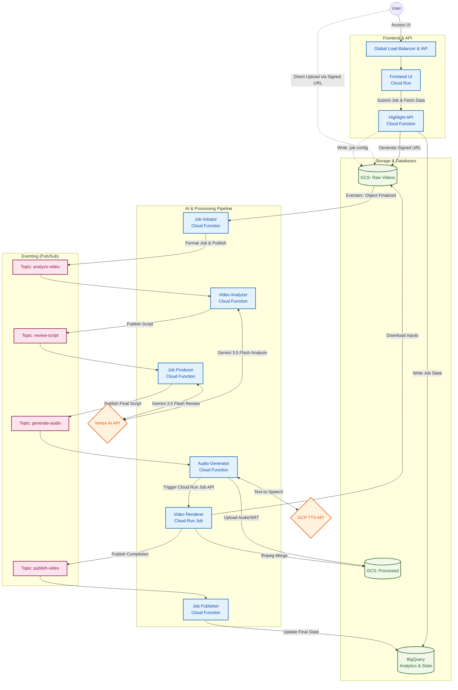

# Automated Highlight Reel Enterprise Application

An event-driven, serverless platform built on Google Cloud that automatically ingests sports videos (via **direct GCS upload** or **YouTube link extraction**), analyzes them using **Vertex AI (Gemini 3.5 Flash)** combined with **CLIP + Reciprocal Rank Fusion**, and generates fully edited highlight reels complete with AI-generated commentary (**Google Text-to-Speech**), custom branding, and interactive timelines.

## Enterprise Key Features

* **AI Model Engine**: Driven by **Gemini 3.5 Flash** (via Vertex AI `global` location and Developer API fallback).
* **Secure Secret Management**: All sensitive credentials (Gemini API Key, IAP Client ID/Secret, Custom Domain, Slack Webhook URL, Proxy Credentials) are managed in GCP Secret Manager via Terraform and injected dynamically into Cloud Functions and Cloud Run jobs.
* **Smart Stage Resume & Checkpointing**: Restarts pick up automatically from the last known good stage (`ANALYZING_SCRIPT`, `REVIEWING_SCRIPT`, `AUDIO_GEN`) or auto-discovered GCS audio artifacts, saving processing time and AI quota.
* **Token-Optimized Video Processing**: High-resolution videos are downsampled via FFmpeg (`scale=-2:480, fps=1`), reducing input tokens from >1.05M down to ~150K tokens to comfortably fit within Gemini's context limit.
* **100% Complete Artifact Purging**: Deleting a job purges BigQuery records, GCS raw upload files (`uploads/{video_id}.mp4`), job/lock metadata, intermediate temp audio/video chunks, and rendered highlight outputs.
* **Job Preset Templates**: 1-click pre-fill templates (*TikTok Hype Reel 9:16*, *Tactical Breakdown 16:9*, *Instagram Square 1:1*).
* **Multi-Language Support**: Supports 12 global languages including English, Spanish, French, German, Italian, Portuguese, Japanese, Greek, Arabic, and Vietnamese.
* **Interactive Timeline Preview**: Rendered commentary scripts display clickable interactive timestamp chips (`00:00 - 00:15`) in the dashboard.

## System Architecture



## Observability & Tracing

This platform is heavily instrumented for enterprise-grade monitoring:
* **Distributed Tracing (OpenTelemetry)**: Full end-to-end trace propagation using `opentelemetry-exporter-gcp-trace`. Traces begin in the React frontend upon job submission and cascade through the Pub/Sub topics to every backend microservice.
* **Structured Logging**: All backend services use `google-cloud-logging` to route cleanly formatted, severity-tagged logs directly into Google Cloud Log Explorer.
* **Resilient Error Handling**: Any failure in the pipeline is immediately caught and logged directly to the `error_message` column in BigQuery, surfacing failures to the React UI in real-time. Rate limit spikes (429/503) use automatic exponential backoff retries.
* **Rich Metadata**: Tracing spans are tagged with critical AI parameters (`language`, `tone`, `team_player_bias`) allowing you to visualize and filter execution times based on job complexity.

## Directory Structure

*   `terraform/gcp/`: Infrastructure as Code (GCP resources).
*   `frontend/`: Vite + React UI application.
*   `backend/`: Python Cloud Functions, managed via `uv`.
*   `docs/`: Detailed project plans and schemas.

## Local Development

### 1. Running the Frontend (Vite + React)
The frontend uses standard NPM scripts. Ensure you have Node.js installed.
```bash
cd frontend
npm install
npm run dev
```
This will start the local Vite development server, usually at `http://localhost:5173`.

### 2. Running the Backend (Python Cloud Functions)
This project uses [`uv`](https://github.com/astral-sh/uv) for lightning-fast Python package management. 

1. **Install uv**: `curl -LsSf https://astral.sh/uv/install.sh | sh`
2. **Sync Dependencies**:
   ```bash
   cd backend
   uv sync
   ```
3. **Run a Cloud Function Locally**: Use the `functions-framework` to spin up a local server for a specific function (e.g., the video analyzer):
   ```bash
   cd backend/analyzer
   uv run functions-framework --target=analyze_video --signature-type=cloudevent --port=8080
   ```
   You can then trigger it by sending an HTTP POST request to `localhost:8080` with a mocked CloudEvent payload.

## Deployment Instructions

### 1. Prerequisites
*   Google Cloud Account with Billing Enabled.
*   `gcloud` CLI, `terraform`, and Docker installed locally.

### 2. Infrastructure Provisioning (Terraform)

For security and least-privilege compliance, infrastructure provisioning is decoupled from the CI/CD pipeline. You must bootstrap the GCP environment locally using an administrative account.

1. Authenticate with Google Cloud as a highly privileged user:
   ```bash
   gcloud auth application-default login
   gcloud config set project YOUR_PROJECT_ID
   ```

2. Initialize and apply Terraform:
   ```bash
   cd terraform/gcp
   terraform init
   terraform apply -var="project_id=YOUR_PROJECT_ID"
   ```
   *Note: This command provisions the Buckets, Pub/Sub Topics, BigQuery datasets, IAM roles, Cloud Run Job (using a dummy image), and Artifact Registry. It also automatically zips the Python Cloud Functions and deploys them.*

### 3. Application Deployment (Cloud Build CI/CD)

Once the infrastructure is up, you use **Google Cloud Build** to completely automate the deployment of your containerized applications (the React UI and the Python Video Renderer).

1. Trigger the automated CI/CD pipeline:
   ```bash
   export PROJECT_ID="YOUR_PROJECT_ID"
   gcloud builds submit --config cloudbuild.yaml .
   ```

This single command will:
1. Build the Vite + React UI container and push it.
2. Build the heavy `ffmpeg` Video Renderer Python container and push it.
3. Deploy the UI to Cloud Run.
4. Update the `video-renderer-job` Cloud Run Job to use your newly built `ffmpeg` code!

### 4. Updating Cloud Functions
If you make code changes to any of the 5 Cloud Functions (`api`, `initiator`, `analyzer`, `producer`, `audio_gen`, `publisher`), simply re-run `terraform apply`. Terraform automatically hashes the Python directories; if it detects changes, it will re-zip them and deploy the new code to GCP seamlessly.

Note that the `api` Cloud Function provides the HTTP endpoints for the UI, including generating Signed URLs to allow the browser to upload large videos directly to GCS securely without passing through the backend.


