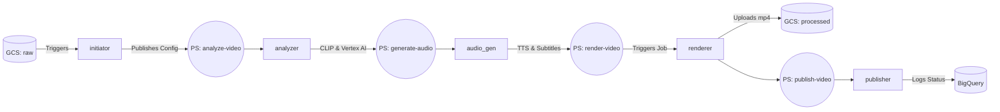

# Highlight Reel Enterprise - Backend Microservices

This directory contains the core intelligence and processing engines of the platform. The backend is designed as a fully event-driven, decoupled microservice architecture utilizing **Google Cloud Functions (Gen 2)** and **Cloud Run Jobs**, orchestrated by **Pub/Sub**.

## Service Modules

1. **API (`api/`)**: Express-like Cloud Function for the web UI to submit jobs, generate Signed URLs for direct-to-GCS video uploads, handle job updates/deletion, and query live job status/logs. Features **Smart Stage Resume** (`POST /api/<job_id>/restart`) to pick up from last known good stages, and complete artifact purging on job deletion. Includes RBAC powered by BigQuery.
2. **Initiator (`initiator/`)**: Cloud Function triggered by Eventarc when a `.job` config file is dropped in GCS. Kicks off the process.
3. **Analyzer (`analyzer/`)**: Downsamples video resolution/FPS (`scale=-2:480, fps=1`) for token efficiency (~150K tokens), then queries **Gemini 3.5 Flash** (via Vertex AI `global` location) to extract highlight timestamps and write a base commentary script based on `tone` and `teamPlayerBias`. Saves `draft_script` checkpoint to BigQuery.
4. **Producer (`producer/`)**: A "Script Supervisor" agent using **Gemini 3.5 Flash**. Reviews the Analyzer's script and timestamps, validating them against tone, bias, and clip length rules. Rewrites and perfects the script before sending it to audio generation, enforcing exact target clip durations. Saves `final_script` checkpoint to BigQuery.
5. **Audio Generator (`audio_gen/`)**: Takes the approved script from the Producer and uses Google Cloud Text-to-Speech to generate audio tracks and `.srt` subtitles. Saves `audioUris` & `srtUri` checkpoints to BigQuery.
6. **Video Renderer (`renderer/`)**: Cloud Run Job running FFmpeg. Combines raw video, generated audio track, and subtitles into `{job_id}.mp4`. Uses FFmpeg's native `adelay` filter for precise audio synchronization without relying on unstable Python audio libraries.
7. **Publisher (`publisher/`)**: Cloud Function that records job completion in BigQuery and handles final notifications.

## Pipeline Architecture



## Observability, Telemetry & Security

* **Secret Manager Integration**: Backend microservices consume API keys (`GEMINI_API_KEY`), OAuth credentials (`IAP_CLIENT_ID`, `IAP_CLIENT_SECRET`), custom domains (`IAP_DOMAIN`), Slack webhooks (`SLACK_WEBHOOK_URL`), and proxy credentials (`PROXY_PASS`) via GCP Secret Manager environment variable injection (`secret_environment_variables`).
* **Structured Logging**: Every microservice initializes `google.cloud.logging`, routing all execution logs uniformly into GCP Log Explorer.
* **Resilient Error Handling**: All functions are wrapped in exception handlers. If any stage crashes, it intercepts the exception, writes the failure cause to the `error_message` column in BigQuery, and re-raises the error so Pub/Sub/Eventarc can retry or dead-letter it appropriately.
* **OpenTelemetry Tracing**: The execution core of every microservice is wrapped in `tracer.start_as_current_span`, propagating distributed trace contexts across Pub/Sub boundaries. Traces are injected with domain-specific tags (e.g., `job_id`, `language`, `tone`) to provide a crystal clear waterfall trace of the entire pipeline in Google Cloud Trace.

## Python Management & Local Development

This project uses [`uv`](https://github.com/astral-sh/uv) for highly optimized Python package management.

### Setup
Navigate to the `backend` directory and sync dependencies:
```bash
cd backend
uv sync
```

### Running Functions Locally
You can run any Cloud Function locally using the `functions-framework`. For example, to run the `analyzer`:
```bash
cd backend/analyzer
uv run functions-framework --target=analyze_video --signature-type=cloudevent --port=8080
```
*You can then trigger the function by sending an HTTP POST request to `localhost:8080` with a mocked CloudEvent payload.*
