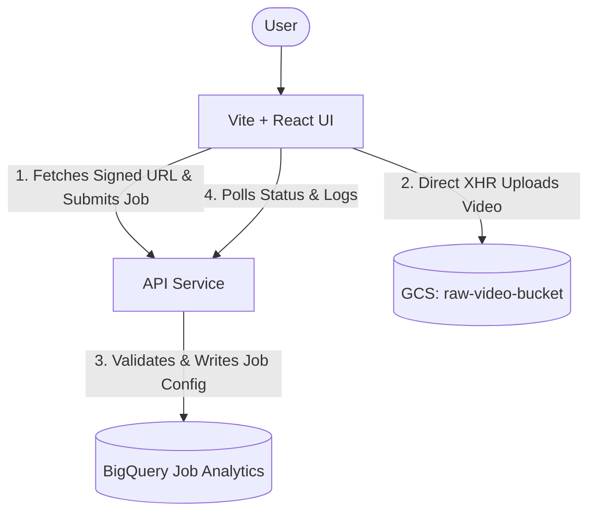

# Highlight Reel Enterprise - Frontend

This directory contains the user interface for the Highlight Reel Enterprise platform. Built with **Vite** and **React**, it features a highly polished, premium "glassmorphism" dark-mode design without relying on utility frameworks like Tailwind.

## Features
* **Preset Templates**: 1-click preset selector (*TikTok Hype Reel 9:16*, *Tactical Breakdown 16:9*, *Instagram Square 1:1*) to quickly pre-fill parameters.
* **Job Configuration**: Dial in parameters including Tone, Language (supports 12 global languages), Aspect Ratio, Music Track, Analysis Mode, Dual Voices, and Team/Player Biases.
* **Smart Restart & Editing**: Allows users to edit job settings or perform a **Smart Resume** that picks up execution from the last known good stage (`ANALYZING_SCRIPT`, `REVIEWING_SCRIPT`, `AUDIO_GEN`) or GCS audio artifacts without re-running Gemini AI.
* **Interactive Timeline Preview**: Rendered scripts feature an interactive visual timeline (`<HighlightTimeline />`) with clickable timestamp chips (`00:00 - 00:15`) in Job Details.
* **Dual Ingestion**: Toggle between uploading raw video files directly or submitting a YouTube URL for backend extraction.
* **Direct-to-GCS Uploads**: Large video uploads execute directly from browser to Cloud Storage via Signed URLs, avoiding payload limits and backend ingress. Duplicate file detection avoids redundant uploads.
* **Live Dashboard & Smart Polling**: Adaptive smart polling (3s active / 15s idle) monitors reel processing in real-time, displays Cloud Run renderer logs, and provides instant video downloads.
* **OpenTelemetry Instrumentation**: Job submissions are wrapped in tracing spans via `@opentelemetry/sdk-trace-web` and exported to GCP Trace with rich attributes (`job.language`, `job.tone`, etc.).

## Architecture



## Local Development

The frontend uses standard NPM scripts. Ensure you have Node.js installed.

1. **Install Dependencies**:
   ```bash
   npm install
   ```
2. **Run Local Server**:
   ```bash
   npm run dev
   ```
   *The application will boot up at `http://localhost:5173`.*
   *Note: Local development is configured to proxy `/api` requests to the production Load Balancer, meaning you can develop against the live Cloud Functions as long as you authenticate through Identity-Aware Proxy (IAP).*

## Deployment

In production, this application is containerized using Docker and deployed as a highly scalable **Google Cloud Run** service. Deployment is fully automated via the root `cloudbuild.yaml` file.
