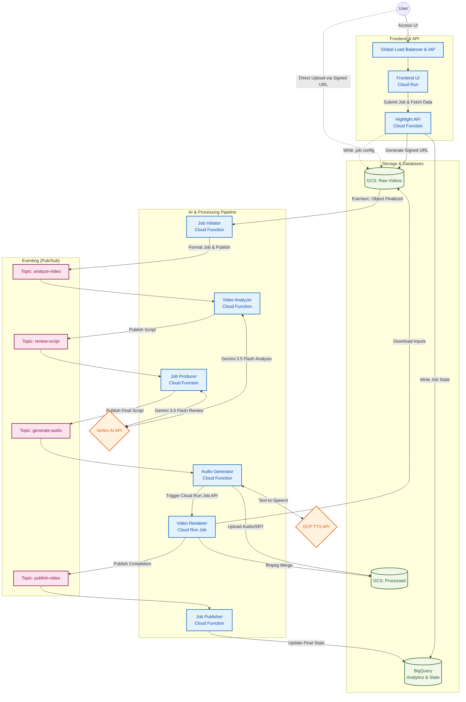

# Highlight Reel Enterprise - Infrastructure as Code

This directory contains the **Terraform** configurations defining the entire Google Cloud serverless architecture for the application.

## Core Principles
*   **Least Privilege**: Strict IAM rules limit what each Cloud Function and Cloud Run Job can access (e.g., the `audio_gen` service cannot write to BigQuery).
*   **Event-Driven**: Complete reliance on Eventarc and Pub/Sub to orchestrate workflows without long-polling or tight coupling.
*   **Cost-Optimized**: Serverless architecture ensures compute is only billed when highlight reels are actively processing.

## Resource Layout

*   **`main.tf`**: Provider configurations and API enablement.
*   **`variables.tf`**: Project-level variables (e.g., `project_id`, `region`, `iap_domain`).
*   **`iap.tf`**: Provisions the Global External HTTPS Load Balancer, SSL Certificates, and Identity-Aware Proxy (IAP) settings.
*   **`dns.tf`**: Manages Cloud DNS records to point custom domains to the Load Balancer IP.
*   **`storage.tf`**: Defines the raw ingest bucket and the processed highlights bucket (with appropriate lifecycle rules and CORS).
*   **`pubsub.tf`**: Defines the 4 primary topics (`analyze-video`, `generate-audio`, `render-video`, `publish-video`).
*   **`iam.tf`**: Defines dedicated service accounts for each microservice and assigns exact roles (`roles/storage.objectAdmin`, `roles/aiplatform.user`, etc.).
*   **`functions.tf`**: Defines the Gen 2 Google Cloud Functions for the backend pipeline, mapping source code to the respective Pub/Sub triggers.
*   **`run.tf`**: Defines the dedicated **Cloud Run Job** for the high-intensity `ffmpeg` Video Renderer, specifying heavy CPU/Memory limits to prevent timeouts.
*   **`bigquery.tf`**: Provisions the `highlight_analytics` dataset and `job_status` tables.
*   **`secrets.tf`**: Provisions GCP Secret Manager secrets (`gemini-api-key`, `iap-client-id`, `iap-client-secret`, `iap-domain`, `slack-webhook-url`, `proxy-pass`) and manages IAM Secret Accessor permissions for application service accounts.

## Architecture Topology



## Deployment

This platform strictly separates **Infrastructure Provisioning** from **Application CI/CD**. To ensure secure, least-privilege deployments, you must run Terraform locally (or via a dedicated admin pipeline) to bootstrap the environment before deploying application code.

**Instructions:**
1. Ensure you are authenticated with GCP as an administrative user (`gcloud auth application-default login`).
2. Verify your user has `Owner` or `Project IAM Admin` roles.
3. Create a `terraform.tfvars` file containing `project_id`, `gemini_api_key`, `iap_domain`, `iap_client_id`, `iap_client_secret`, `slack_webhook_url`, and `proxy_pass` (ensure `terraform.tfvars` is ignored by git).
4. Run the following commands:
```bash
terraform init
terraform plan
terraform apply
```

### Next Step: Application CI/CD

Once the Terraform execution completes successfully, the infrastructure (Buckets, IAM, Pub/Sub, etc.) is fully provisioned. However, the Cloud Run UI and the Video Renderer container still need to be built and deployed.

Navigate back to the root of the project and trigger Cloud Build:
```bash
cd ../..
export PROJECT_ID="YOUR_PROJECT_ID"
gcloud builds submit --config cloudbuild.yaml .
```
This will build your Docker containers, push them to the Artifact Registry that Terraform just created, and deploy them to Cloud Run.
